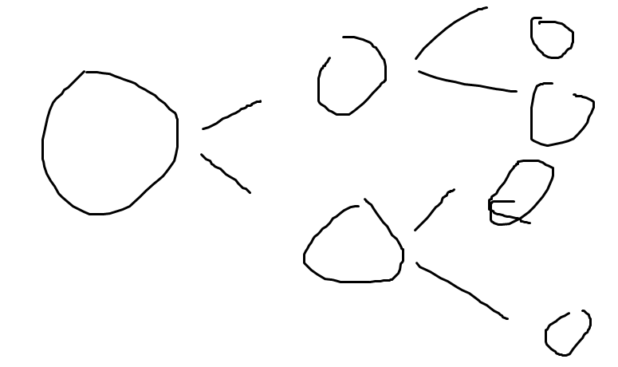
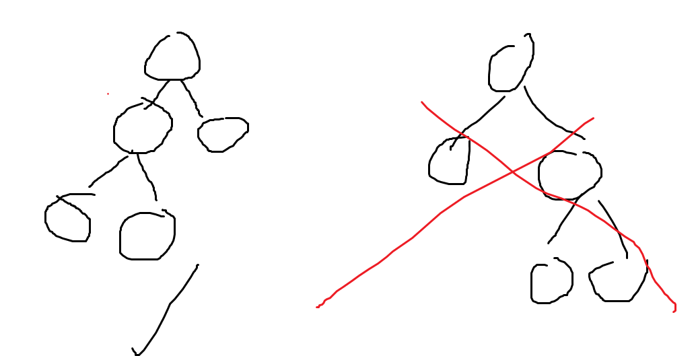
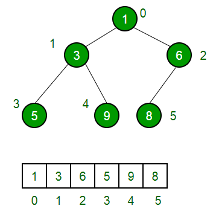
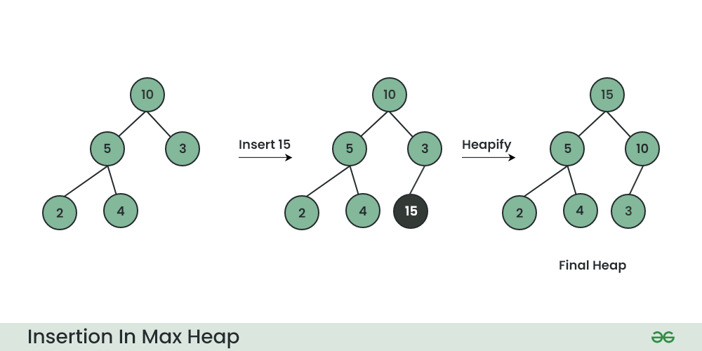
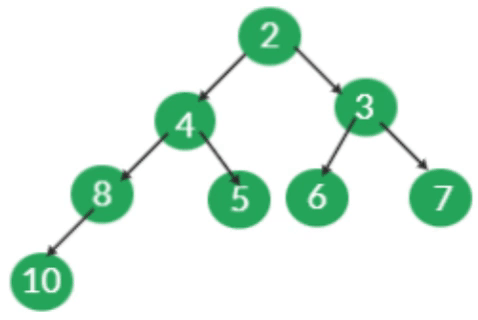
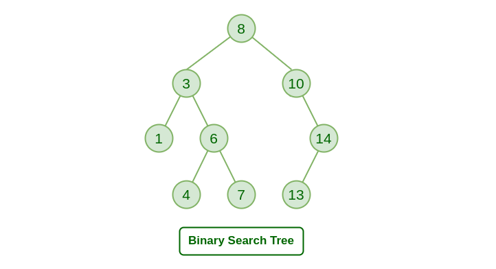
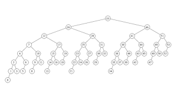
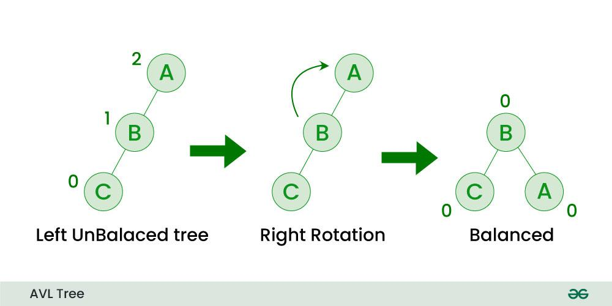
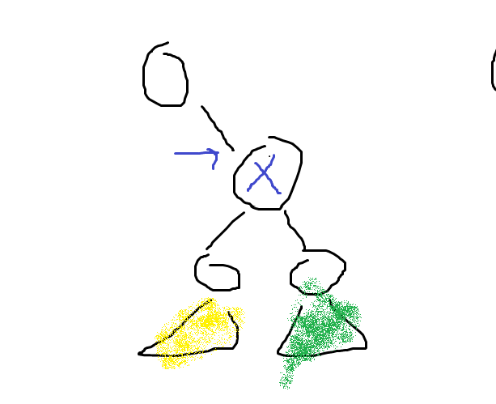

# Lecture 11

## Priority Queues (ADT)
This is a queue with a twist. The thing that will get out first is the one with the highest priority

### Types
- max type => extract max value
- min type => extract min value

### Requirements
- insert(value)
- (For the max verstion) extract_max() => get the thing with most priority
- (For the min verstion) extract_min()

**After this is optional**
- find(value) {optional} => returns YES or NO (pointer)
- delete(value) 
- decreased_key($v_{old},v_{new}$) (where $v_{old} > v_{new}$)
- increased_key($v_{old},v_{new}$) (where $v_{old} < v_{new}$)

### Example
```
insert(4)
insert(16)
insert(2)
insert(8)
extract_max() => returns 16
extract_max() => return 8
```
This will be use in the shortest path.

## Heap (Literal translation: A house)

Do you remember what is a binary tree. No? lmaoooo why don't you pay attention la lmao. xD

### what is a binary tree (recap)
- A tree with at most 2 children per node. You can have left child and right child each node.



### Requirements to be a heap
- Be a complete binary tree. (A )
    - every level is 'full' except for the last level, maybe.
- The last level must be as "to the left" as possible

- The binary to be as packed as possible. The smaller the height, the better it is.

### The structure


as you can see, you can tell the index imediately with this structure.

|node|v|
|---|---|
|left child|2v+1|
|right child|2v+2|
|parent|$\lfloor\frac{v-1}{2}\rfloor$|

you can represent it like an array.

Also, the min is the value at the roots (if you can't see that).

### Value requirements
- Value of each node must be smaller than value of all children. (Look at the example from the picture above)

### implement requirements
- insert(value) => place the value in the next place available 


- extract_min()


    - How to do it (You can see in the image, it starts when all the nodes are green)
    ```c
    extract_min()
        s <- A[0]
        A[0] <- S[size-1]
        size<-size-1
        FIX THE HEAP (we will be using heapify_down(0)$in this case)
        return s
    ```
    ```
    heapify_down(i)
        li <- 2i+1
        ri <- 2i+2

        while li<size (i has at least 1 child)
            if ri< size (2 children)
                if A[i] < A[li] and A[i] < A[ri]
                    break
                else if A[li] < A[ri]
                    swap A[i] with A[li]
                    i <- li
                else...
                    swap the things
            else (For 1 child case)
                if it is bigger than the child
                    swap
                else
                    do nothing
    ```
    The complexity is O(n)

    height of heap is O($log(n)$)

- insert and extract_min() took $O(log(n))$ time

if we use this in an array, whatever way, we would get $O(log(n))$ time.

### Cons
- Heap is not very friendly with find operation

## Binary Search Tree

### Structure Requirement
- BE a binary tree

### Vallue Requirements
- everything in the left node is smaller than you
- everything in the right node is bigger (or equal to) than you


### Travesal
- in order: 1 3 4 6 7 8 10 13 14 (You get sorted data! :D)

### Method
- Find(value)
    
        if V == value
            find it
        else if V<value
            go right
        else
            go left
- Insert(value)

        move until you find your place like find()
- extract_min()

        find the min by going the most left side
        remove the min
        now removing is kinda hard
            if something is removed, the subtree below that thing comes up to replace it

### Height of the tree
- worst case $O(n)$ -- what!?

## Balanced binary search tree
There are many type of balanced binary search tree
Like:
- Red-Black trees
- 2-3 trees
- splay trees
- AVL trees <- we're gonna talk about this one.




That is valid btw.
### Balance requirement  (for AVL)
- Every node, the height of left subtree and height of the right subree must be <= 1 different from each other. Must hold for every node.

### Terms
- Because the definition allows us to have difference in the height. Therefore, you can have a **Left heavy**, a **Right heavy** or a **Even**.

### Fixing the height problem

- Using rotation - changing the root of the tree itself??
- But in some case, the graph is double heavy, simply rotating won't going to cut it.
- You can try rotating the subnode first and then the whole node (divide and conquer)

### Height 
- height(v) = max(height(v.left), height(v.right))+1
- height of AVL tree is $O(log(n))$

### Summary
- insert and Extract-Min = $O(log(n))$
- Find = $O(log(n))$
- Delete
    - If the node has no children, then, just delete the node and then call it a day.
    - If there are 1 child, move that child up.
    - If there are 2 children, then oh boy. You need to find something to replace the x bellow, what you can do is to extract min from the green subnode and replace it in the x.

    
    - The complexity is $O(log(n))$

## Sorting Algorithm
- HeapSort
- BalancedBinarySearchTreeSort

Complexity: $O(log(n))$ (Insert + Extract-Min)

## Foot note

There are a better data structure and algorithm out there like:
- Fibonacci heap - it does the sorting and all above in the sorting secture BETTER.