# Lecture 12 - Shortest paths

## Single-Source Shortest Paths

This is not all-pair shortest path

|to single dest|All pair|
|-------------|--------|
|Single source|Single source|
|single destination|all vertices destinmation|
|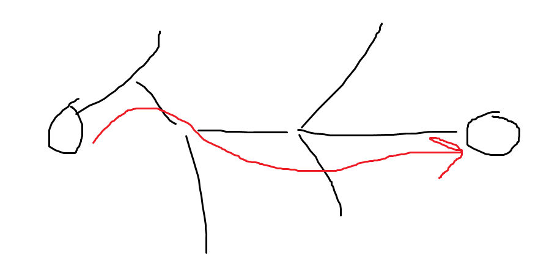|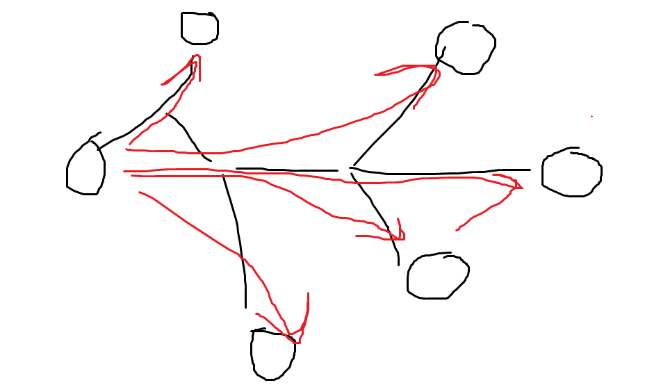|

Whatever way, you need to find to find the path to all of the vertices. So in this lecture, we will only talk about the second one.

**returns**
1. dist - an array  (dist[v] - a number of how far)
2. parent - an array (Which vertex is the parent)

### a tense edge

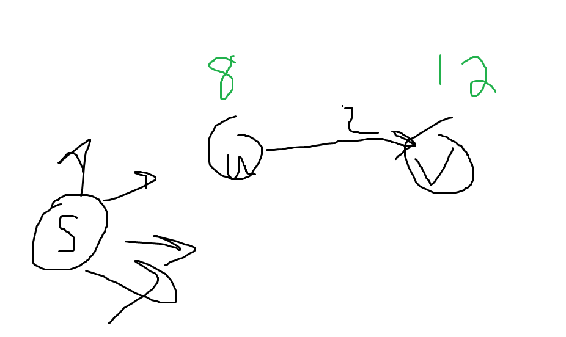

The shortest path from vertex s is displayed in green. If you take a loog at that. The shortest path to v is 12, which the path from s->u->v is 10. Therefor, it is tense.

This is how you can make it 'relax'.

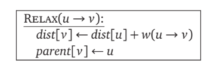

```
dis[u] + w(u->v) < dist[v] ------ tense
dis[u] + w(u->v) > dist[v] ------ relax
```

This is the whole idea of the shortest path

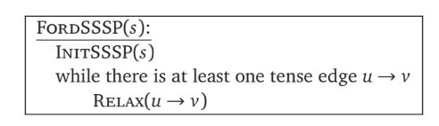

### Example

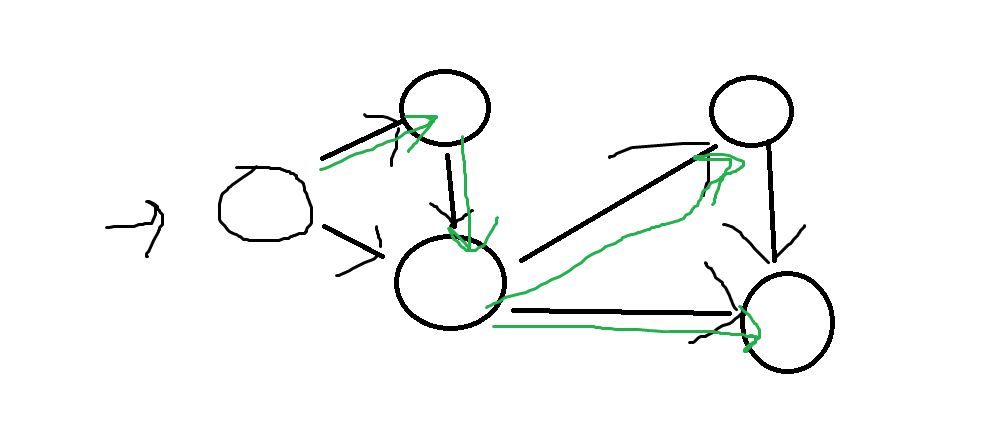

This graph run shortest path algorithm.


If you want to find the shortest path from one vertex to another, say a -> b. You have to start from b and then trace back it's parent back until you find it, right?

We start by saying the shortest path is $\infty$

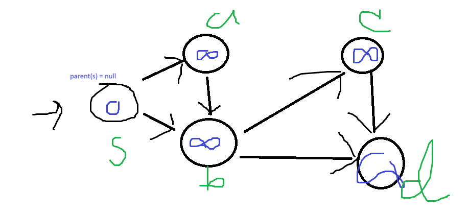

As you can see, every vertex is TENSE

This is how you do it futhur (New example)

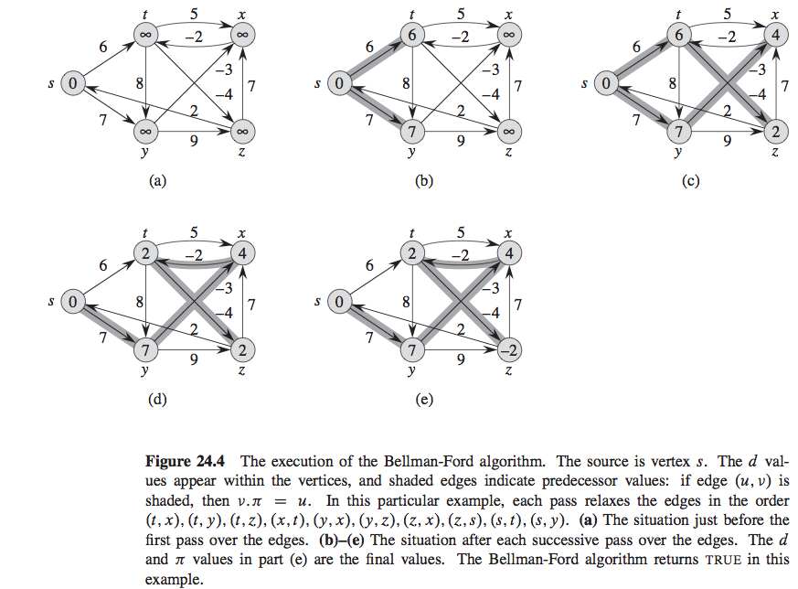

## Unweighted graphs: Breadth-frist search

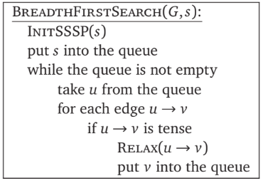

As you can see, this is similar to the one shown before. This is because the 

## Directed Acycllic Graphs: Depth-first Search

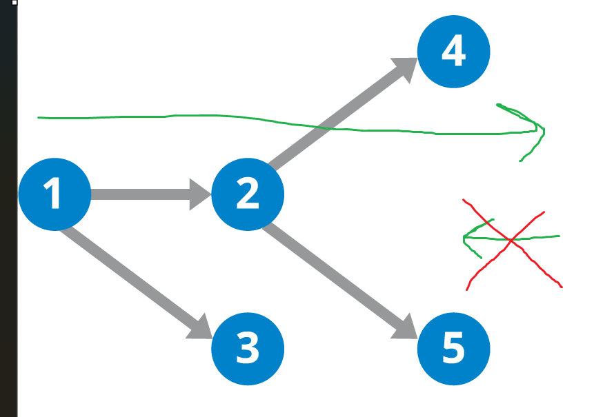

DAG graph recap

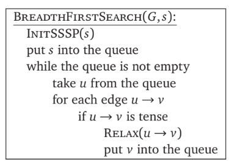

Note that: weight can also be negative too

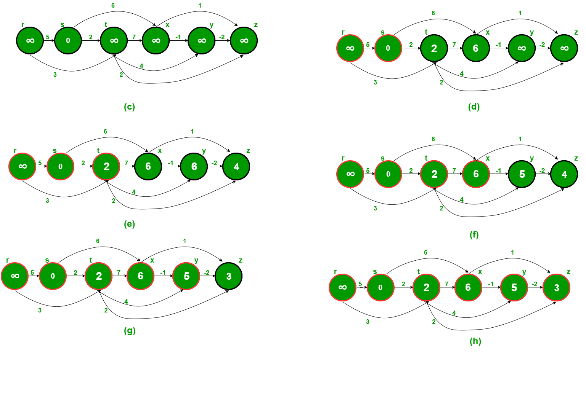

The graph always goes from left to right. Therefore, the $\infty$ on the most left will never be changed.

## Dijkstra's algorithm

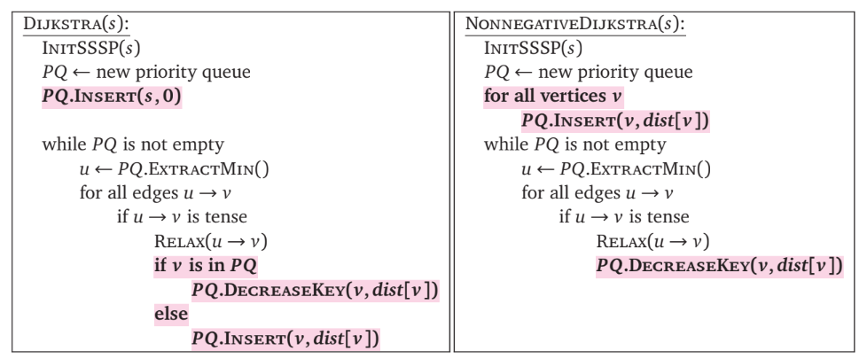

This is not designed for a negative weight

### Example - it might be wrong tho...

#### initialize

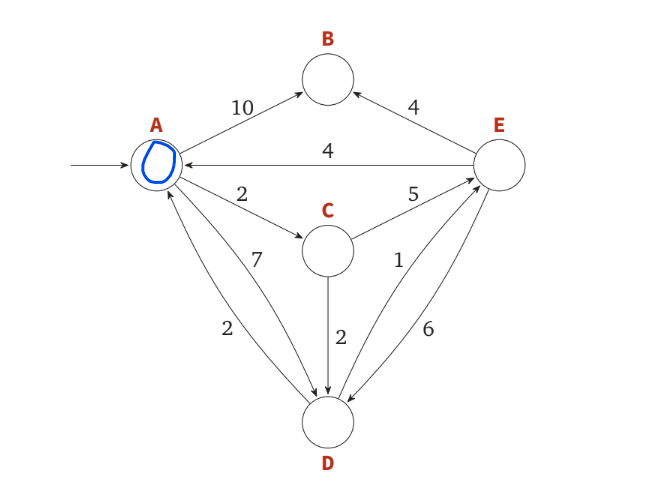

#### Next

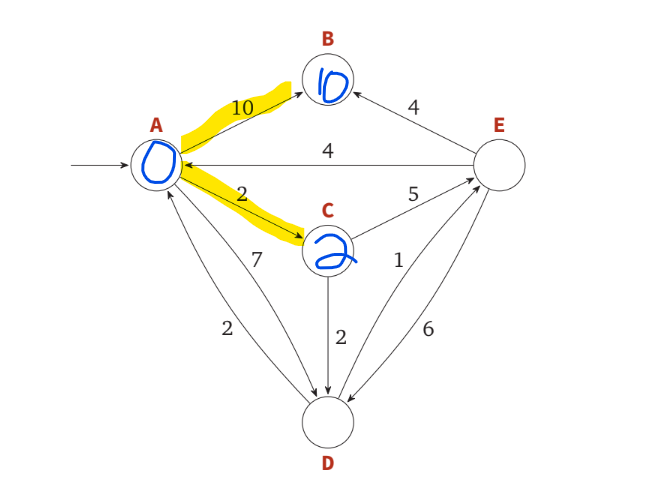

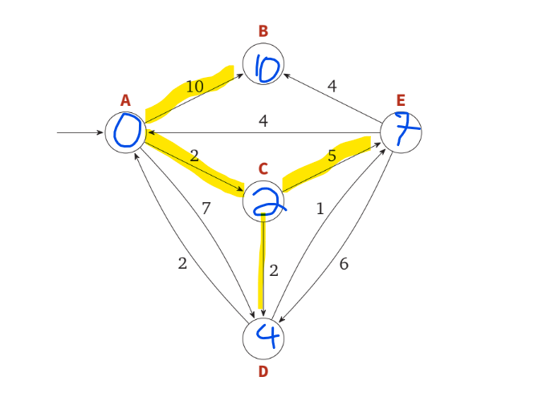

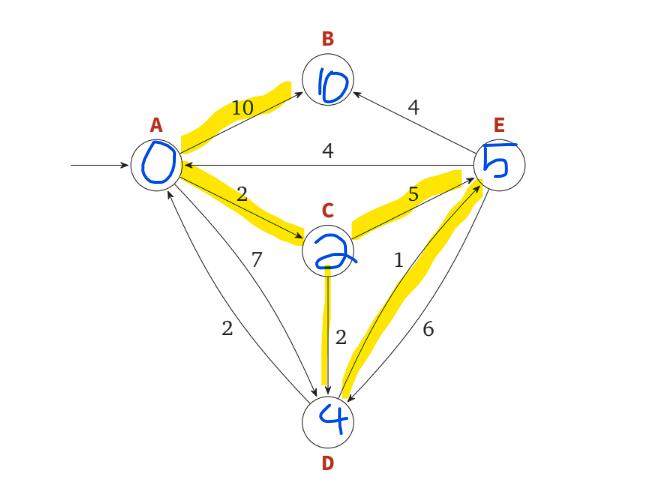

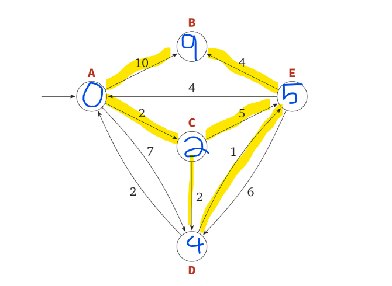

Imagine there is a negative loop, where if you loop inside, the distance will keep decreasing.

**DO NOT ALLOW THAT TO EXIST**

Ahem...

## Bellman-Ford Algorithm

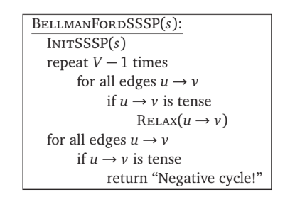

### Example 

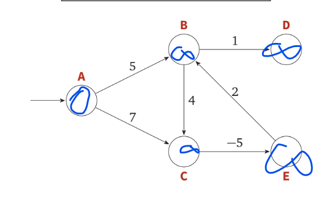

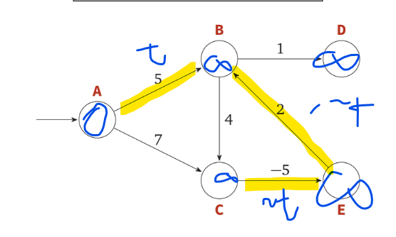

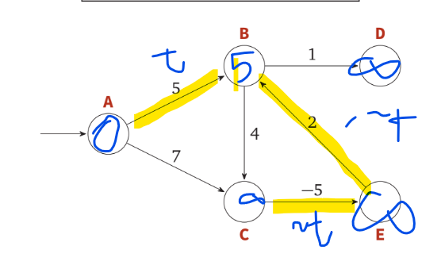

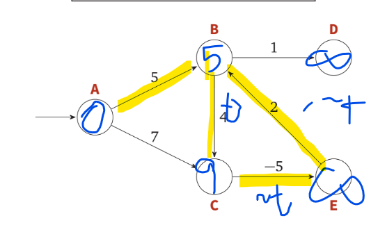

Literally check every edge for V-1 times

And then check every edge one more time so it can find the hidden negative loop.

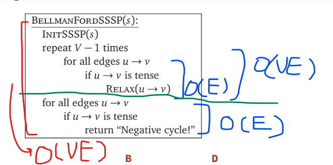

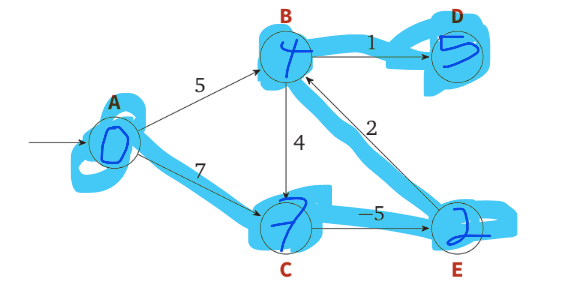

### Example: What if I don't have a DAG

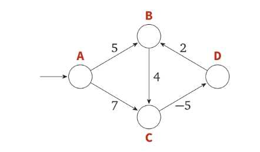

Not to worry! Try this: 

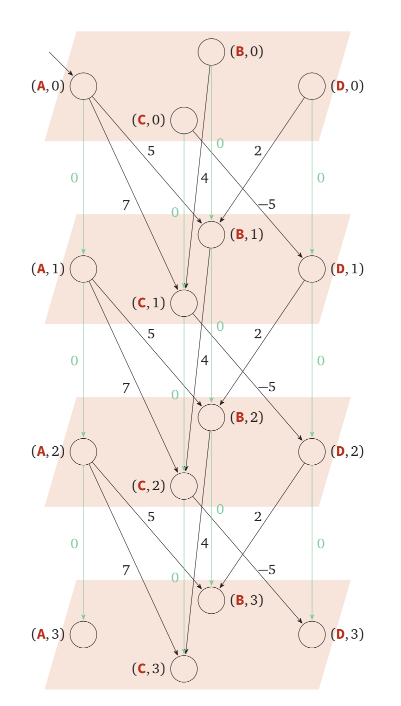

If we duplicate the original graph V times and put them into floors. We'll get a DAG! Yay!

vertices

V' = Vx{0,1,...,V-1}

= {(v,i)|v $\epsilon$ V and i $\epsilon$ {0,...,V-1}}

edges 

problem: 
shortest path from (s,0)

Algorithm: DAGSHORTESTPATH

Running time: $O(V'+E')=O(V^2+EV)=O(EV)$


## Summary

|type of graph|algorithm|time complexity|
|-------------|---------|---------------|
|unweighted|BFS|$O(V+E)$|
|weighted DAG|dag shortest path|$O(V+E)$|
|weighted no neg edge|Dijkstra|$O(Elog(V))$|
|weighted|Bellman-Ford|$O(EV)$|

