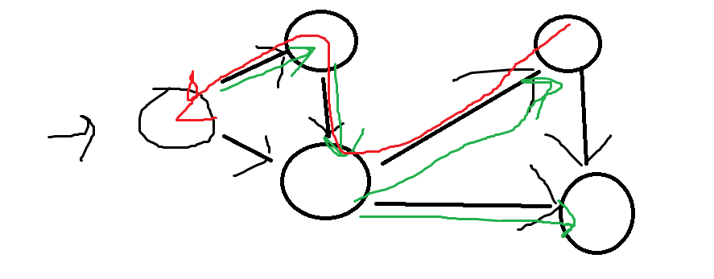

# Lecture 12 - Shortest paths

## Single-Source Shortest Paths

This is not all-pair shortest path

|to single dest|All pair|
|-------------|--------|
|Single source|Single source|
|single destination|all vertices destinmation|
|||

Whatever way, you need to find to find the path to all of the vertices. So in this lecture, we will only talk about the second one.

**returns**
1. dist - an array  (dist[v] - a number of how far)
2. parent - an array (Which vertex is the parent)

### a tense edge


The shortest path from vertex s is displayed in green. If you take a loog at that. The shortest path to v is 12, which the path from s->u->v is 10. Therefor, it is tense.

This is how you can make it 'relax'.


```
dis[u] + w(u->v) < dist[v] ------ tense
dis[u] + w(u->v) > dist[v] ------ relax
```

This is the whole idea of the shortest path


### Example


This graph run shortest path algorithm.



If you want to find the shortest path from one vertex to another, say a -> b. You have to start from b and then trace back it's parent back until you find it, right?

We start by saying the shortest path is $\infty$


As you can see, every vertex is TENSE

This is how you do it futhur (New example)


## Unweighted graphs: Breadth-frist search


As you can see, this is similar to the one shown before. This is because the 