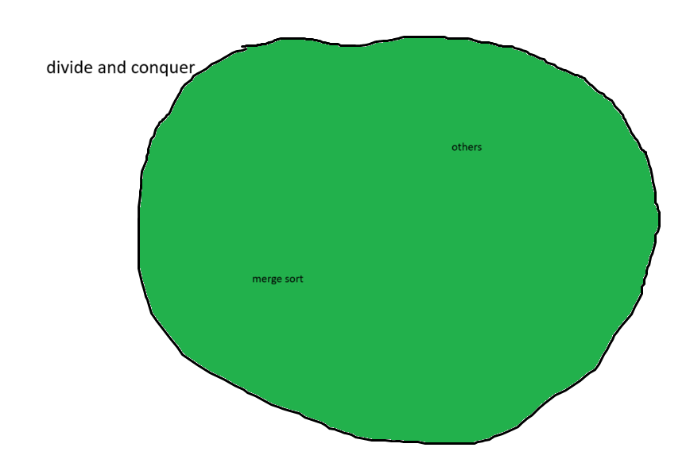
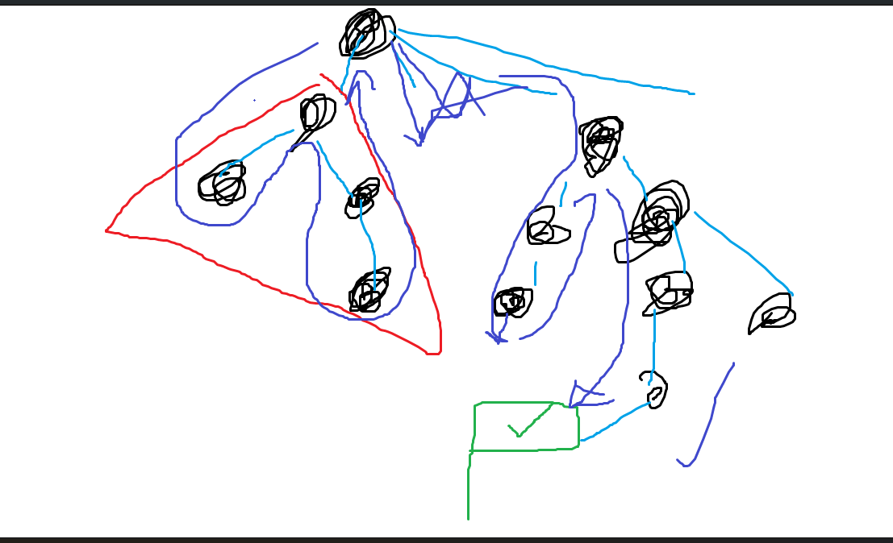
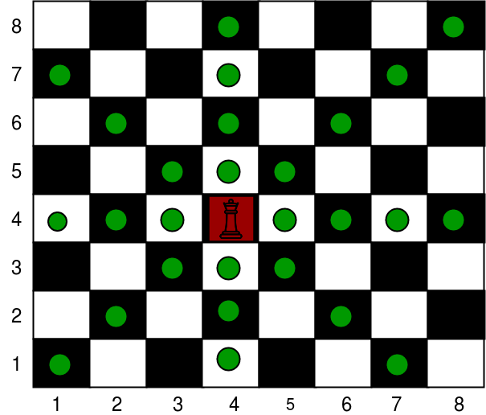
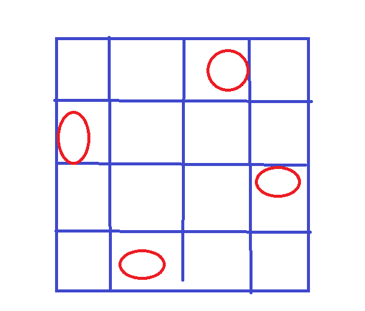
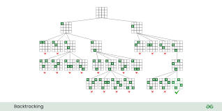

# Lecture 13 - Greedy algorithm

Greedy algorithm is a family of algorithms that utilize the concept, just like divide an conquer.



## Backtracking Algorithm
Basically, try all the things. Here's how it works.

|step|what to do|
|----|----------|
|1|do something|
|2...n| recurse for n -1 steps|

In summary, do the first step and let other step done by recursion.

```pseudo
for each possible 1st step option
    try that option
    recursively do the other step
```

Here's the visualization: 



### n-Queens Problem

A move of a queen in chess.



A queen visualization.


Question: can we place 4 queens on a 4x4 board so that they won't capturing each other.

Answer: Yes like this.



Visualization: 


Question: What about for an nxn chess board?

Answer: Try back tracking! Try ALL possible options until you find the solutions!



```pseudo
NQueens(i) // Assuming that we have populated 1 - (i-1) rows, And now we want to populate rows i - n.
    if i = n + 1 // If we've finished populating.
        answer Q
    else
        for j <- 1 to n // for all the rows
            fail <- false
                for k <- 1 to i
                    if (k,Q[k]) conflicts with (i,j) // in conflict means they are in the same place
                        fail <- true // We have to handle conflict detection on our own
                if not fail
                    Q[i] = j
                    NQueens(i+1)

Call NQueens(1) to get the answer
```

## Greedy Algorithm
Greedy is also lazy. It's not going to go into all of the options. No back tracking. Basically, you get the best thing possible at the moment.

### Knapsack Problem
Knapsack is a bag in some sense.

Imagine trying to rob a bang. You would have a bag and then tell the bank stuffs to put as many loot as possible into your bag.\\

Suppose that your bag can held up to weight W.

#### 0-1 Knapsack
Basically, you must get the whole of it or none of it.

-|1|2|3|4|5|
|-|-|-|-|-|-|
|wi|5|4|4|2|5|
|Pi|20|10|15|12|10|

Suppose W = 10, what are you gonna do to maximize your profit. Of course! 2,3,4 is the best option.

Strategy 1: Highest price (that still fits in the bag) -> bad :(

Strategy 2: Lowest weight -> still bad :(

Stratehy 3: Highest $\frac{price}{weight}$ ratio -> It doesn't work either!! :(

Protip: There's really not gonna be a greedy algorithm that's going to work perfectly. But if you want to make sure that, in some cases, some of the strategy works. You just have to prove it. (We'd like to prove it, prove it)

Like this but more depressing and less dancing.


#### Fractional Knapsack Problem
In this one, you can actually take a portion of the options you have.

## Interval Scheduling
Here's the situation: SKE students have a lot of classes and we need to schedule the study time table. We cannot have any class overlap. (We, however, do not have to include time for sleep and eat, because REAL programmers don't need that.)

```pseudo
Given n events/intervals
    Event i has start time Si
        Finishing time fi
```

What is the maximum number of **non-overlapping** events(class)?

Strategy 1: Starts the earliest (that doesnt'overlap with what I have picked)

## Proof the correctness of Greedy Algorithm

1. Greedy Stays Ahead - Break it into multiple steps and prove that your greedy algorithm runs no worse than the optimal algorithm in all and each steps.
2. Exchange argument - 

```pseudo
ends first (O(nlog(n)))
Sort intervals by finishing time (MERGE SORT) (say f1 <= f2 <= ... <= fn after sorting)
S <- {}
for i <- 1 to n
    if interval i does not intersect with the last interval picked
        S <- S U {i}
return S

### Example: greedy algo -> solution G = <g1, g2, ..., gl>