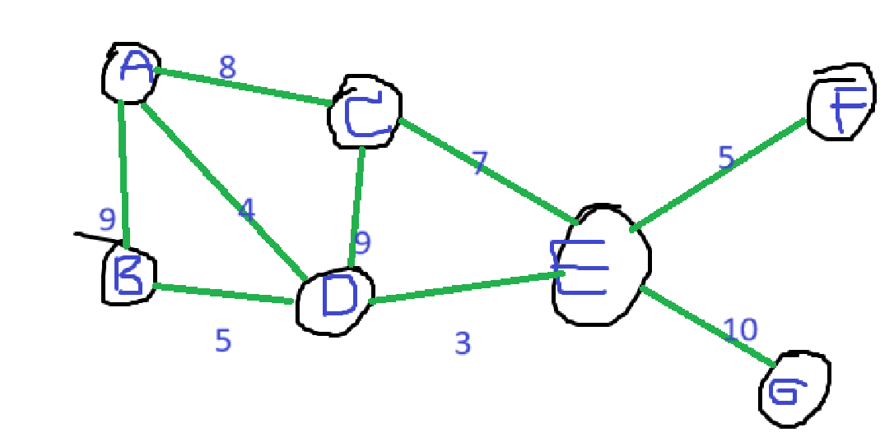
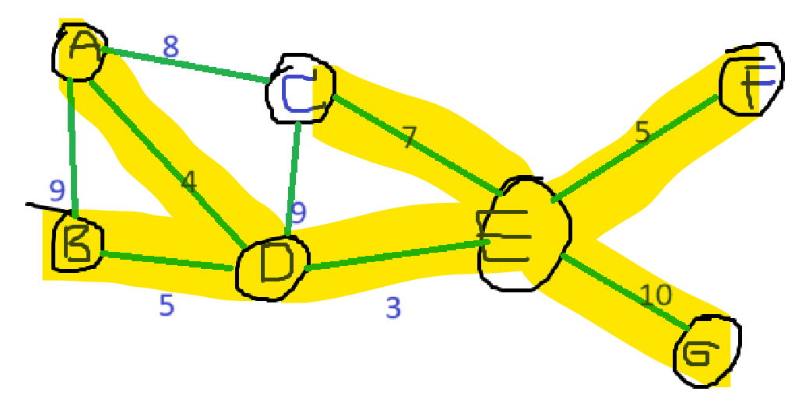
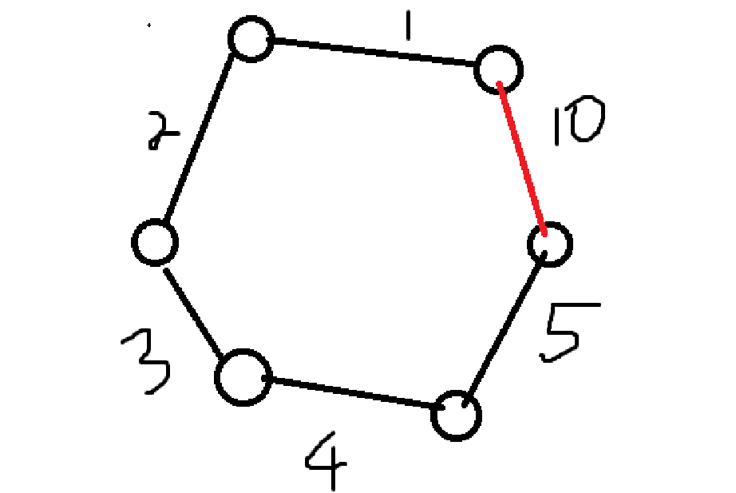
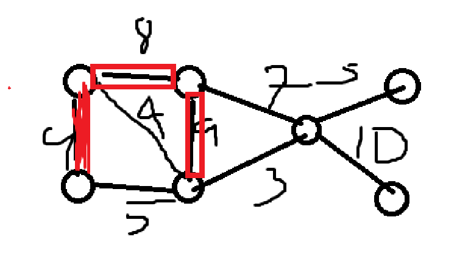
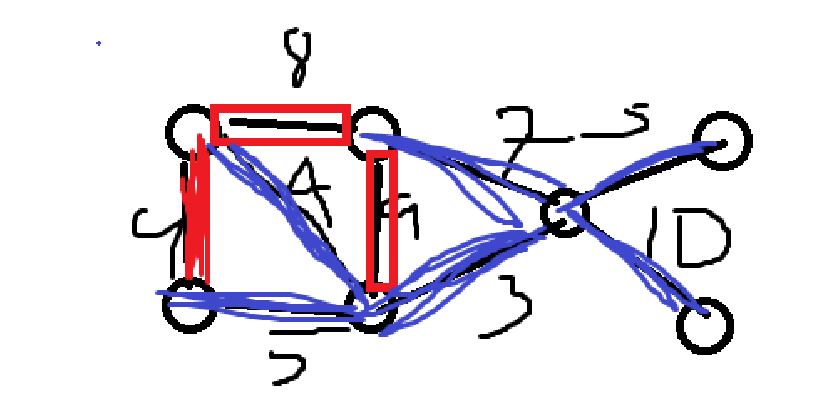

# Lecture 14
## Introduction
Welcome to the last lecture :dying:

**Tip**: Do the final review problem first and then watch the explanation video later

The final for this course will be cumulative but will focus mostly on the second half of the course, but it will contain the stuffs from the first half as well.

And that will be on May, 9th, 2024. On the morning. Cheat sheet is allowed, both front and back. In total, 2 sheets and 4 pages.

There's no class next week, use these 3 hours to try to do the problems.

**End of the introduction**

## Minimum spanning tree
Let G be an undirected graph



Imagine this is a graph of a connected city. You want to build the connecting roads between the cities. How can you make it cheaper to construct?

Problem Given G1, find a sappning tree of G with the minimum total weight.

Example:



This is the lowest total weight. How do we do this?

### The "Greedy" Rules
Let's introduce to "Greedy" Rules first. So we can use this to solve the problem.

We're going to color the edge with red or blue.

1. "Red" rule cycles - The idea is to remove the largest thing but still make the graph a cycle.



2. "Blue" rule cut - A cut is a subset of edges, the when you move the graph gets disconnected

Ex.





## Boruvka's algorithm

1. Each vertex is its own root
2. Look around and pick the edge that is the cheapest
3. Those edges become blue
4. Group them by the connectedness of the of each blue edges
5. Look around the group and pick the edge that is the cheapest

You need ```V - 1``` edges for each graph.
```psuedo
each vertex is a group by itself
S <- {}
while |S| < V-1 // O(log2(V)) => (log(V)) at worst # becuase if each time the size of the group grows twice.
    for each group // all of this takes O(E)
        e <- chepest edge coming out of the group
        S <- S U ```{e} <- color e blue
        merge the two groups joined by e
```
Complexity => O(Elog(V))
Basically, Boruvka's algorithm is just repeating the blue rule over and over again. Now, let's consider the complexity of the this alogortihm.

## Prim's algorithm

```psuedo
S <-  {some starting vertex}
while |S| < V-1 // O(V)
    e <- cheapest edge coming out of S // O(E)
    S <- S U {e}
```
Time complexity => O(VE)

```psuedo
S <- {Some starting vertex}
while |S| < V-1
    v <- cheapest vertex // 1
    S <- S U {edge group - v}
    update vertex cost // 2
```
```1``` and ```2``` are priority queue
complexity O(E log(V))

Pro tip: Prim's algorithm actually works the same way with dijktra's algorithm

## Kruskal's Algorithm
The easiest algorithm to execute by hand.

1. Look at the samllest edge

```psuedo
sort edges by weight (small -> large) // O(E log E) = O(E log(V))
for each edge
    if it can be added (without make a cycle) // take O(V+E)
    add.
```

##Disjoint-Set Data Structure

"Union-Find"
- union(u,v) - this thing can join the group of vertices by referencing the vertex in the group.
- find(v) - returns the "leader" of the group. The "Leader" here is the representative vertex of the group.

### Technique 1 - union by rank
```pseudo
if rank[u] > rank[v]
    u <- v

```
### Technique 2 - path compression
just point everything to the leader haiya
O(log(n)) - average

### Technique 3 - 1 and 2 combined
=> $O(\alpha{(b)})$ - alpha thing is the inverse Achkermann function, which is an increasing function that is growing really fast. But for some reason we can treat it as a constant here.

MST: 
[2000] $O(E\alpha{(m,n)})$ time - we're still looking for the one algorithm that is $O(E)$.